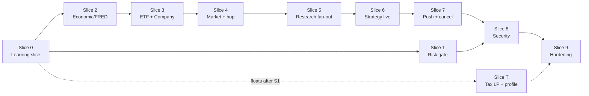
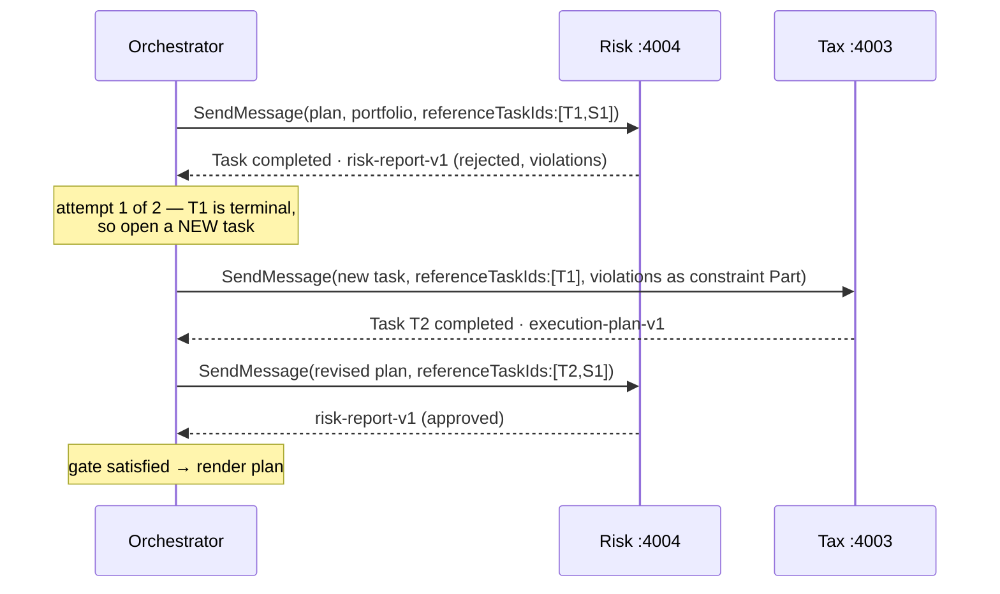
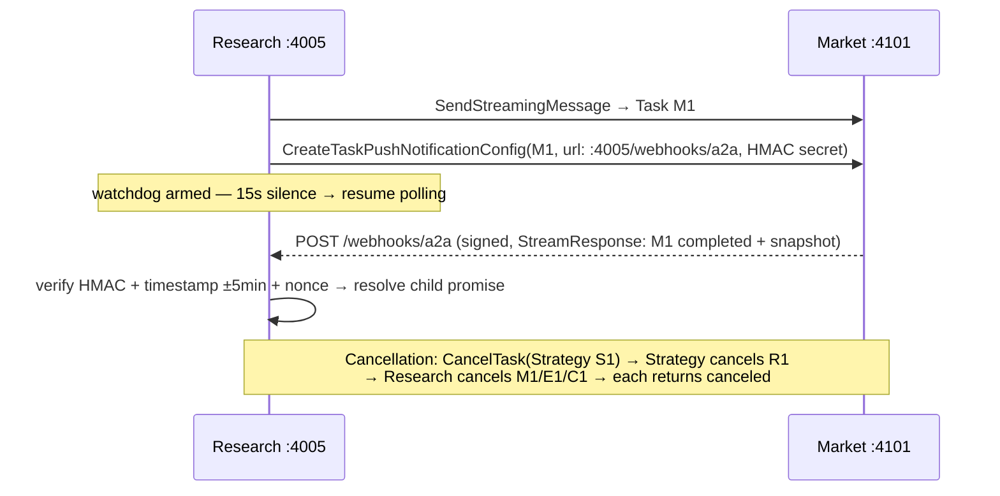

# Implementation Plan — A2A Portfolio Tax Optimizer Capstone

The starter plan an AI coding agent follows to build `completeDesign.md`. Design only — no source code. Companion docs: `design.md` (blueprint), `a2a-learning-slice.md` (Slice 0), `completeDesign.md` (target system), `TODO.md` (concept checklist).

**Prime directive:** after every slice, the pipeline runs end-to-end (degraded is fine). Degradation paths are the seams that make slicing possible.

---

## 1. Decision Log (blocking — resolve before any code)

### D1 — Pricing

**Question:** `portfolio-v1` carries cost basis but no market price; Tax (gain/loss per lot), Risk (beta-weighted exposure, sector $ weights), and savings estimates all need quotes — but the Market Agent doesn't exist until Slice 4 and is only reachable via Strategy→Research.

**Default:** a static price fixture in `packages/schemas` — a `prices-v1` table (`symbol → { price, asOf }`) shipped in-repo. `portfolio-v1` gains two fields per holding: `currentPrice: number` and `priceAsOf: ISO datetime`, stamped by the Portfolio Agent from the fixture at standardization time. In Slice 9, the Orchestrator optionally refreshes prices via a Market Agent snapshot before invoking Tax/Risk; the fixture remains the fallback and the deterministic source for tests and `--scripted` mode.

**Rationale:** Tax and Risk stay deterministic and testable from Slice 0/1; live quotes become an enrichment, not a dependency — the same degraded-mode pattern used everywhere else.

**Affects:** `portfolio-v1`, new `prices-v1` fixture; Portfolio, Tax, Risk, Market, Orchestrator; Slices 0, 1, T, 9.

### D2 — Tax solver spec

**Question:** "small LP pass" needs an objective, constraints, library, wash-sale rules, and a replacement table.

**Default:**

- **Library:** `javascript-lp-solver` (pure JS, zero native deps, mixed-integer capable). Time limit 10 s → fall back to the Slice 0 greedy harvester with `metadata.degraded: true`.
- **Objective (maximize):** `Σ harvested-loss × applicable rate` + `λ_loc × asset-location score` − `λ_txn × trade count` (λ_loc = 0.1, λ_txn = 0.05, both relative to the tax term).
- **Constraints:**

  | # | Constraint |
  | --- | --- |
  | C1 | Wash-sale: no buy of the same or substantially-identical symbol within ±30 days of any harvested sale (checked against plan buys and lots purchased ≤ 30 days before `asOf`) |
  | C2 | Post-trade allocation drift: each asset-class weight within ±5 pp of `allocation-v1` target |
  | C3 | Cash per account ≥ 0 after all trades |
  | C4 | Sell quantity ≤ lot quantity; whole shares only (integer vars) |
  | C5 | No sells in tax-advantaged accounts unless required by C2 (harvesting has no benefit there) |

- **Substantially-identical replacement table:** static map in `packages/schemas` (`replacements-v1`), e.g. VTI↔ITOT↔SCHB, VXUS↔IXUS, BND↔AGG, VOO↔IVV↔SPY. Same-row symbols are wash-sale conflicts with each other; a replacement buy must come from a *different* row targeting the same asset class.
- **Wash-sale window:** 30 calendar days each side; a lot with `purchaseDate: null` blocks C1 evaluation → `input-required` (this is the existing Flow C trigger).

**Rationale:** pure-JS solver keeps the 10-process dev loop trivial; the objective/constraint set is the smallest one that makes the async task lifecycle real and exercises `input-required` naturally.

**Affects:** new `replacements-v1`; `execution-plan-v1` (unchanged shape, richer `reason` strings); Tax; Slice T (greedy remains Slice 0 baseline and permanent fallback).

### D3 — Tax assumptions

**Question:** estimated savings needs tax rates; no user tax profile exists in any schema.

**Default:** define `tax-profile-v1` — `{ filingStatus, marginalRatePct, ltcgRatePct, statePct }` — with hardcoded defaults `{ single, 24, 15, 0 }` used whenever the user supplies nothing. The Orchestrator exposes an optional `/taxprofile` CLI command to override; the profile travels to Tax as a data Part alongside `portfolio-v1`. No brackets, no NIIT, no state tables — flat rates only.

**Rationale:** flat assumed rates keep the solver linear and demos runnable with zero user setup; the schema slot exists so realism can grow later without a contract change.

**Affects:** new `tax-profile-v1`; Tax, Orchestrator; Slice T (greedy harvester in Slices 0–T uses the same defaults for its savings estimate).

### D4 — Philosophy parsing

**Question:** Strategy is LLM-free but receives free text like "ER under 0.10%, skip energy." Who parses it?

**Default:** the Orchestrator's LLM does all extraction via the `derive_allocation` tool schema (see §2, Tool surface): `philosophy` is a closed enum (`bogleheads-three-fund | esg-tilt | dividend-growth | all-weather | custom`), constraints are typed fields matching `research-request-v1.constraints`. Strategy owns a static **philosophy→target-weights table**:

| Philosophy | US total market | Intl developed | US bonds | Other |
| --- | --- | --- | --- | --- |
| bogleheads-three-fund | 50 | 30 | 20 | — |
| esg-tilt | 45 | 30 | 20 | 5 ESG thematic |
| dividend-growth | 60 | 20 | 20 | — |
| all-weather | 30 | 15 | 40 | 7.5 gold, 7.5 commodities |
| custom | user-supplied weights passed through the tool call (must sum to 100) |

In `--scripted` mode a keyword matcher replaces the LLM (exact phrase → enum value); unrecognized text → `RequestMalformedError` from Strategy.

**Rationale:** keeps the "only LLM lives in the Orchestrator" invariant intact; the enum makes tool-call behavior testable and the table makes Strategy deterministic.

**Affects:** `research-request-v1`, `allocation-v1` (unchanged shapes; enum documented); Strategy, Orchestrator; Slices 0, 6.

### D5 — Risk data source

**Question:** beta and drawdown need per-symbol data; Risk calls no API and no agent. Thresholds beyond the 25 % sector cap are undefined, as is ETF sector treatment.

**Default:** static `risk-factors-v1` table in `packages/schemas`: `symbol → { beta, kind: etf|stock, sectorWeights: { sector → pct } , maxDrawdownEstPct }` covering every symbol in `prices-v1` and `universe-v1`. Stocks have a single 100 % sector entry; ETFs carry a lookthrough vector (top 5 sectors + `other`). Thresholds:

| Rule | Threshold | Blocking |
| --- | --- | --- |
| Portfolio beta | 0.5 ≤ β ≤ 1.5 | yes |
| Sector concentration (lookthrough) | any sector ≤ 25 % | yes |
| Estimated max drawdown (weight-averaged) | ≤ 35 % | yes |
| Unknown symbol (not in table) | β = 1.0, sector `unknown`; flag | no (advisory) |

**Rationale:** an in-repo factor table keeps Risk synchronous, deterministic, and dependency-free — the properties the gate role requires; lookthrough via a static vector avoids a holdings API.

**Affects:** new `risk-factors-v1`; `risk-report-v1` (violations reference rule names above); Risk; Slice 1.

### D6 — Research candidate universe & scoring

**Question:** what symbols does Research rank, and with what weights?

**Default:** static `universe-v1` in `packages/schemas`: `assetClass → candidate symbols` (8–12 per class, covering every philosophy's asset classes). Composite score per vehicle, each component normalized 0–1 within its asset class:

| Component | Weight | Source |
| --- | --- | --- |
| Cost (expense ratio, inverted) | 0.40 | ETF Agent (FMP) |
| Quality (tracking error inverted for ETFs; fundamentals composite for stocks) | 0.35 | ETF / Company Agents |
| Macro fit (regime + recession-signal adjustment per asset class) | 0.25 | Market Agent (embedding Economic) |

Missing component (degraded source) → component scored 0.5 and `confidence` lowered per `completeDesign.md §5 Flow D`. Ties break alphabetically by symbol — output is fully reproducible.

**Rationale:** a static universe bounds FMP's 250 req/day budget (≤ ~30 symbols total, cached 24 h) and makes scoring a pure function of agent outputs.

**Affects:** new `universe-v1`; `research-request-v1`, `research-brief-v1` (add `confidence` per ranked vehicle); Research, ETF, Company, Market; Slice 5.

---

## 2. Engineering Conventions (would otherwise be guessed)

**Language & module system.** Plain JavaScript (ESM) — `.js` files with `import`/`export`, `"type": "module"` throughout. Node ≥ 20 (SDK requirement). No TypeScript, no build/transpile step: every workspace runs directly via `node`. Prettier with `semi: false`. Contract safety comes from runtime validation, not static types: Zod schemas in `packages/schemas` are the single source of truth, parsed at every process boundary; JSON-schema exports generated from them for agent cards. JSDoc annotations are welcome where they aid editor IntelliSense but are never required.

**Monorepo & dev runner.** npm workspaces per `completeDesign.md §12` layout. One `npm run dev` at the root uses `concurrently` to start processes in dependency order: data tier (4104 → 4102/4103 → 4101) → mid tier (4005) → top tier (4001–4004) → Orchestrator (3000). Every server exposes `GET /healthz` (200 + `{ name, version }`); each process waits for its downstream dependencies' `/healthz` before announcing ready; the Orchestrator performs card discovery only after all top-tier health checks pass, and marks unreachable agents offline rather than crashing (per §14 failure matrix).

**Orchestrator tool surface (4 tools).** Parameter and return contracts (JSON-schema derived from `packages/schemas`):

| Tool | Parameters | Returns | Notes |
| --- | --- | --- | --- |
| `standardize_portfolio` | `rawText: string` | `portfolio-v1` artifact ref + warnings | Sync; surfaces Zod rejection to user |
| `derive_allocation` | `philosophy: enum (D4)`, `customWeights?`, `constraints: { maxExpenseRatioPct?, excludeSectors?, preferredDomiciles? }` | `allocation-v1` ref + `degraded?` | Streaming; LLM extracts constraints from free text |
| `optimize_taxes` | `portfolioRef`, `allocationRef`, `taxProfile?` | task id (async) → `execution-plan-v1` ref | May pause `input-required`; answer relayed on same taskId |
| `validate_risk` | `planRef`, `portfolioRef`, `referenceTaskIds` | `risk-report-v1` ref | Sync; verdict drives gate |

**Gate-enforcement system prompt** (clauses, enforced in prose to the LLM *and* as a hard code post-condition): never render an execution plan without an `approved` `risk-report-v1` in the same `contextId`; on `rejected`, re-run `optimize_taxes` with the violations as constraints, max 2 remediation attempts, then present violations to the user; never call Research directly (it is not a tool); always pass `referenceTaskIds` to `validate_risk`.

**Persistence statement.** Everything is in-memory: task stores (per server), Orchestrator task registry and remediation counters, `MemorySession`, LRU caches, webhook nonce cache, circuit-breaker state. Process restart = clean slate; no recovery, no database. This is a deliberate non-goal of the learning project and is documented in each agent's README stub.

**Testing plan.** Vitest per package.

- *Contract tests* (`packages/schemas`): every `*-v1` schema has valid/invalid fixture pairs; round-trip parse tests; JSON-schema export snapshot tests.
- *Agent unit tests*: executor logic tested against an in-process `DefaultRequestHandler` on an ephemeral port; external APIs mocked with `undici` `MockAgent` replaying recorded fixtures (`demos/fixtures/{finnhub,fmp,fred}/*.json`) — no live keys in CI.
- *`--scripted` fixtures*: the sample conversations in `sampleInputOutput.md` / `happyPathSampleInputOutput.md` become the canonical fixture set; `demos/` scripts assert on artifact contents, not console text.
- *Failure-matrix tests*: one integration test per row of `completeDesign.md §14`.

**Auth details.**

- `GetExtendedAgentCard` (Tax): HTTP bearer scheme declared in `securitySchemes`; static token from `EXTENDED_CARD_TOKEN` env var, held by the Orchestrator only.
- Card signatures: JWS per RFC 7515 with **ES256** (P-256), RFC 8785 canonicalization, via the SDK's `generateAgentCardSignature` / `verifyAgentCardSignature`. `CARD_SIGNING_KEY` is the PEM-encoded private key (one shared dev key for all top-tier agents).
- Public-key distribution: each signing agent serves its JWKS at `/.well-known/jwks.json`; in dev the Orchestrator additionally pins the expected public JWK via `TRUSTED_CARD_JWK` env var and verifies against the pin (fetch-then-verify without pinning is circular).
- Data-tier `X-Data-Key`: single shared secret `DATA_TIER_KEY` (Research → data agents), per `completeDesign.md §11`.
- Webhooks: HMAC-SHA256 with `WEBHOOK_SECRET`, timestamp window ± 5 min, nonce cache (see config table).

**Consolidated config table** (every number in one place; env-overridable, defaults shown):

| Setting | Default | Used by |
| --- | --- | --- |
| Ports | 3000, 4001–4005, 4101–4104 | all |
| `GetTask` poll interval | 2 s | Orchestrator↔Tax, Research↔data agents (fallback) |
| Data-agent task timeout | 10 s each | Research fan-out |
| Webhook watchdog (silence → poll) | 15 s | Research |
| Webhook timestamp window / nonce cache | ± 5 min / 10 min TTL | Research |
| Circuit breaker | 3 consecutive failures → open; 60 s cool-down | Research per data agent |
| Cache TTLs | FMP profiles/fundamentals 24 h · Finnhub quotes 15 min · FRED 24 h | ETF, Company, Market, Economic |
| Provider budgets | FMP ~250 req/day (shared ETF+Company) · Finnhub 60 req/min | data tier |
| LP solver time limit | 10 s → greedy fallback | Tax |
| Remediation loop max | 2 | Orchestrator |
| Sector cap / beta band / drawdown cap | 25 % / 0.5–1.5 / 35 % | Risk (D5) |
| Score weights cost/quality/macro | 0.40 / 0.35 / 0.25 | Research (D6) |
| `input-required` idle reminder | 60 s | Orchestrator |
| SSE reconnect (`SubscribeToTask`) | 3 attempts, 1 s backoff ×2 | Orchestrator, Research |
| Task retention (in-memory) | 24 h or process lifetime | all servers |

---

## 3. Slice Plan

Dependency order and float:



**Ordering constraints:** `2→3→4→5→6→7` is a strict chain (each builds on the previous pattern or agent). Slice 1 and Slice T float — Slice 1 anywhere after 0, Slice T anywhere after 1 (its remediation constraints feed the LP). Slices 8–9 are last: 8 hardens surfaces that must exist first; 9 exercises everything.

Demo numbering below supersedes the list in `completeDesign.md §12` (more slices → more demos). Demos `01–07` are Slice 0's, unchanged.

---

### Slice 0 — Learning slice *(already designed — summary only)*

**Goal:** the four-process core from `a2a-learning-slice.md`: Orchestrator (client, LLM + `--scripted`), Portfolio (sync), Strategy (SSE, philosophy lookup stub), Tax (async lifecycle, greedy harvester).

**A2A concepts (→ `completeDesign.md §2`):** agent cards/discovery, `supportedInterfaces`, skills, text/data Parts, `SendMessage`, `SendStreamingMessage`, task lifecycle, `GetTask`, `ListTasks`, `input-required`, `SubscribeToTask`, `CancelTask`, artifacts, `contextId`, error taxonomy, version negotiation.

**Touches:** `packages/schemas`, `packages/a2a-common`, `apps/{orchestrator,portfolio-agent,strategy-agent,tax-agent}`.

**Schemas:** `portfolio-v1` (**amended per D1**: `currentPrice`, `priceAsOf`), `allocation-v1`, `execution-plan-v1`; new fixtures `prices-v1`, philosophy table (D4).

**Decisions consumed:** D1 (fixture), D4 (enum + weights table; keyword matcher in scripted mode).

**Exit criteria:** demos `01-discovery` … `07-end-to-end` pass in `--scripted` mode with no API keys.

**Degradation path:** n/a — this is the baseline everything else degrades *to*.

**Learner takeaway:** the full A2A v1.0 message/task surface — every later slice only adds topology, never new envelope mechanics.

---

### Slice 1 — Risk gate + remediation loop

**Goal:** Risk Agent as a synchronous validation gate; Orchestrator refuses to render plans without approval and drives the bounded remediation loop.

**A2A concepts:** `referenceTaskIds`; **task immutability** — terminal Tax task can't be reopened, remediation opens a *new* task referencing the old one under the same `contextId`; `TASK_STATE_REJECTED` — Risk rejects upfront any request missing `referenceTaskIds` or referencing non-terminal tasks.

**Touches:** new `apps/risk-agent`; Orchestrator (gate post-condition, `validate_risk` tool, remediation counter); `packages/schemas`.

**Schemas:** new `risk-report-v1`, `risk-factors-v1` (D5). Tax accepts an optional violations data Part as remediation constraints (greedy: excluded symbols/sector caps).

**Flow:**



**Decisions consumed:** D5; D1 (factor math uses fixture prices).

**Exit criteria:** demo `08-risk-gate` — one approved run, one rejected→remediated run, one double-rejection ending in the 3-option user prompt (`sampleInputOutput.md §4`).

**Degradation path:** Risk unreachable at discovery → Orchestrator reports the gate offline and *withholds* plans (fail-closed, stated to the user); the rest of the pipeline still runs and artifacts remain inspectable via `/tasks`.

**Learner takeaway:** tasks are immutable once terminal — follow-up work is a new task linked by `referenceTaskIds`, not a resurrected old one.

---

### Slice 2 — Economic Agent (FRED): the external-API wrapper pattern

**Goal:** smallest data agent; establishes the canonical wrapper shape every other data agent clones — API client behind an executor, in-process LRU cache, rate-budget ownership, upstream failure → task `failed` with `retryAfter`.

**A2A concepts:** sync `SendMessage` with explicit `returnImmediately: false`; `acceptedOutputModes` negotiation (client requests `application/json`); upstream-error → `failed` mapping with machine-readable retry metadata; secrets confinement (FRED key never leaves the process).

**Touches:** new `apps/economic-agent`; `packages/a2a-common` (shared cache + failure-mapping helpers born here).

**Schemas:** new `economic-indicators-v1` (with `asOf` staleness field).

**Flow:** trivial (request → cache hit/miss → FRED → artifact); no diagram needed.

**Decisions consumed:** none (pattern-setting slice).

**Exit criteria:** demo `09-economic-wrapper` — standalone client script: cold call (FRED fetch), warm call (cache hit, still a full A2A task), simulated 429 → `failed` + `retryAfter`, all against recorded fixtures; live-key mode optional.

**Degradation path:** nothing upstream depends on it yet; from Slice 4 onward, Economic down → Market omits `macro` from snapshots (field is optional).

**Learner takeaway:** wrapping a plain REST API as an A2A skill — a cache hit is still a full task, so protocol behavior is uniform.

---

### Slice 3 — ETF + Company Agents (FMP, shared rate budget)

**Goal:** clone the Slice 2 wrapper twice; two processes sharing one provider budget (FMP ~250 req/day) forces the caching discipline to be real.

**A2A concepts:** repetition by design — sync `SendMessage`, artifacts, error mapping. New: two servers sharing an upstream quota, each still owning its own card/skill (`profile-etfs`, `fundamentals`).

**Touches:** new `apps/etf-agent`, `apps/company-agent`; shared FMP client + budget tracker in `packages/a2a-common`.

**Schemas:** new `etf-profile-v1`, `company-fundamentals-v1`. Field-availability caveat: exact FMP free-tier endpoints verified here; unavailable fields (e.g. tracking error) become optional with a documented fallback (score component defaults per D6).

**Decisions consumed:** D6 (universe file bounds request volume: ≤ ~30 symbols, 24 h TTL).

**Exit criteria:** demo `10-fmp-agents` — profile the full `universe-v1` from fixtures; assert total simulated FMP calls ≤ budget; warm re-run does zero upstream calls.

**Degradation path:** either agent down → (from Slice 5) Research marks that section `sources: missing` and lowers confidence; before Slice 5, nothing depends on them.

**Learner takeaway:** agents are cheap to stamp out once the wrapper pattern exists — the protocol surface is identical, only the skill differs.

---

### Slice 4 — Market Agent (Finnhub, SSE) + Market→Economic hop

**Goal:** first *streaming* data agent and first nested delegation: Market is both server (to its caller) and client (to Economic).

**A2A concepts:** server-side SSE (`taskStatusUpdate` narration of fetch progress); **artifact chunking** — `taskArtifactUpdate` with `index`, `append`, `lastChunk` for the multi-part snapshot (quotes chunk, then regime, then macro); nested client hop inside an executor; card-driven lazy discovery (Market fetches Economic's card before first macro call).

**Touches:** new `apps/market-agent`; Economic (unchanged, now has a consumer).

**Schemas:** new `market-snapshot-v1` (embeds optional `economic-indicators-v1`).

**Flow (Flow E, from the consumer's view):**

```mermaid
sequenceDiagram
  participant C as Client (script; later Research)
  participant M as Market :4101
  participant E as Economic :4104
  C->>M: SendStreamingMessage(market-snapshot skill)
  M-->>C: SSE statusUpdate(working, "fetching quotes")
  M-->>C: SSE artifactUpdate(quotes chunk, index:0)
  M->>E: SendMessage(macro-indicators)
  E-->>M: completed · economic-indicators-v1 (cache TTL 24h)
  M-->>C: SSE artifactUpdate(regime+macro chunk, index:1, lastChunk)
  M-->>C: SSE statusUpdate(completed) — terminal closes stream
```

**Decisions consumed:** D1 (fixture symbols define which quotes to fetch in demos).

**Exit criteria:** demo `11-market-stream` — streamed snapshot with chunked artifact reassembled and Zod-validated; Economic-down run yields snapshot without `macro`.

**Degradation path:** Market down → (from Slice 5) Research brief lacks `marketContext`, macro-fit component scores 0.5; Economic down → snapshot minus macro.

**Learner takeaway:** an executor can itself be an A2A client — delegation nests without the caller knowing.

---

### Slice 5 — Research fan-out (polling only)

**Goal:** the sub-orchestrator: parallel fan-out to Market/ETF/Company, settle-everything aggregation, deterministic scoring, circuit breakers. Webhooks deliberately deferred to Slice 7 — child completion is observed via `GetTask` polling and SSE consumption only.

**A2A concepts:** sub-orchestration behind a single skill (fan-out invisible to the caller); parallel task management with per-child timeout budgets; `GetTask` polling as the universal fallback; partial-failure policy (one child fails → degraded brief; all fail → task `failed`); provenance via `sources[]` task ids; `CancelTask` cascading to in-flight children (basic version; propagation *through* Strategy arrives in Slice 7).

**Touches:** new `apps/research-agent` (server + embedded client pool); `packages/a2a-common` (circuit breaker).

**Schemas:** new `research-request-v1`, `research-brief-v1` (+ `confidence` per D6), `universe-v1`.

**Flow (Flow D, polling variant):**

```mermaid
sequenceDiagram
  participant S as Caller (script; later Strategy)
  participant R as Research :4005
  participant M as Market
  participant E as ETF
  participant C as Company
  S->>R: SendMessage(research-request-v1, returnImmediately:true)
  R-->>S: Task R1 submitted
  par fan-out (10s budget each)
    R->>M: SendStreamingMessage → consume SSE
  and
    R->>E: SendMessage (sync)
  and
    R->>C: SendMessage (sync)
  end
  Note over R: allSettled — never fail fast;<br/>circuit breaker per child
  R->>R: score & rank (D6 weights, ties alphabetical)
  S->>R: GetTask(R1) — poll 2s
  R-->>S: R1 completed · research-brief-v1 (sources[])
```

**Decisions consumed:** D6 (universe + weights + missing-component rule).

**Exit criteria:** demo `12-research-fanout` — full brief from fixtures; kill ETF Agent mid-run → brief completes degraded with `sources` gap and lowered confidence; kill all three → task `failed`; cancel R1 mid-fan-out → children canceled.

**Degradation path:** Research itself down → Strategy still uses its Slice 0 lookup stub (not wired yet); nothing breaks.

**Learner takeaway:** sub-orchestration is encapsulation — a mid-tier agent hides an entire task tree behind one skill and one artifact.

---

### Slice 6 — Strategy goes live (Research delegation + degradation flag)

**Goal:** replace Strategy's lookup stub with live Research delegation (Flow B′) while keeping the stub as the wired-in fallback.

**A2A concepts:** an agent that is server *and* client mid-stream (Strategy streams SSE upstream while awaiting a downstream task); merging a child artifact into the parent's streamed artifact; artifact `metadata.degraded` as a first-class contract; end-to-end `contextId` propagation through three tiers.

**Touches:** `apps/strategy-agent` (delegation + fallback), Orchestrator (surfaces the degraded notice to the user).

**Schemas:** `allocation-v1.targets[].preferredVehicles` now populated from `research-brief-v1.rankedVehicles` (contract shape unchanged — the swap promised in `completeDesign.md §4`).

**Flow:** Flow B′ exactly as diagrammed in `completeDesign.md §5`; no restatement.

**Decisions consumed:** D4 (constraints ride `research-request-v1`), D6 (vehicle provenance).

**Exit criteria:** demo `13-live-allocation` — run once healthy (real ranked vehicles + market context in output); kill Research mid-demo, re-run → allocation completes with `metadata.degraded: true` and the CLI's "heuristic rankings" warning (`sampleInputOutput.md §2`).

**Degradation path:** that *is* this slice's feature — Research unreachable → lookup table; data agents partially down → live but lower-confidence brief.

**Learner takeaway:** graceful degradation is a schema concern (`metadata.degraded`), not just an ops concern — callers must be told what quality they got.

---

### Slice 7 — Push notifications + cancellation propagation

**Goal:** replace Research's polling of slow children with signed webhook callbacks; make `CancelTask` cascade through the full tree (Orchestrator → Strategy → Research → data agents).

**A2A concepts:** `CreateTaskPushNotificationConfig` / `Get…` / `List…` / `Delete…` config lifecycle; callbacks POSTed in `StreamResponse` format; HMAC signature + timestamp + nonce verification; watchdog fallback to `GetTask` after 15 s silence; multi-hop cancellation propagation.

**Touches:** `apps/research-agent` (webhook receiver `POST /webhooks/a2a`, config registration, watchdog); `apps/market-agent` (callback emitter — the slow/streaming child); `apps/strategy-agent` + Orchestrator (cancel propagation); `packages/a2a-common` (webhook signing/verification helpers).

**Schemas:** none new (callback payloads are protocol-level `StreamResponse`).

**Flow:**



**Decisions consumed:** §2 auth details (HMAC parameters, nonce cache).

**Exit criteria:** demo `14-push-notifications` — webhook path observed (trace shows zero polls); unsigned and replayed callbacks rejected; blocked webhook → watchdog falls back to polling and the task still completes. Demo `15-cancellation` — cancel at the Strategy level, assert every descendant task reports `canceled` via `ListTasks`.

**Degradation path:** webhooks unavailable (child card lacks `pushNotifications`, or receiver down) → polling, which Slice 5 already proved; cancellation failure at any hop → that subtree's tasks age out by timeout, parents still return `canceled`.

**Learner takeaway:** push notifications invert the polling relationship — and must be treated as an untrusted inbound surface (sign, window, nonce).

---

### Slice 8 — Security pass

**Goal:** authenticate the mesh: data-tier `securitySchemes`, Tax's extended card, JWS card signatures, and the `AUTH_REQUIRED` task state.

**A2A concepts:** card-declared `securitySchemes` with client-side credential binding (Research reads each data-tier card and attaches `X-Data-Key`); `GetExtendedAgentCard` behind bearer auth (public vs privileged capability disclosure); JWS card signatures — `generateAgentCardSignature` at boot, `verifyAgentCardSignature` + pinned JWK at discovery, refuse-to-route on failure; `TASK_STATE_AUTH_REQUIRED` — a data agent receiving a request without valid `X-Data-Key` pauses the task as `auth-required` (distinct from `input-required`: credentials, not data).

**Touches:** all data agents (key check + `auth-required`), Research (credential binding from cards), Tax (extended card), Orchestrator (signature verification, `/agents` shows `card signed ✓`), `packages/a2a-common` (signing utilities).

**Schemas:** none new; agent cards gain `securitySchemes` / `signatures` / `capabilities.extendedAgentCard`.

**Decisions consumed:** §2 auth details (ES256, JWKS + pinned JWK, `EXTENDED_CARD_TOKEN`, `DATA_TIER_KEY`).

**Exit criteria:** demo `16-secured-cards` — tampered Tax card fails verification → Orchestrator refuses to route and reports Tax offline; extended card fetch fails without token, succeeds with it; Research call without `DATA_TIER_KEY` → child task pauses `auth-required`, resumes when credential supplied.

**Degradation path:** verification failure degrades exactly like unreachability (refuse-to-route + capability-offline reporting, §14 rows 8–9) — the pipeline runs minus the untrusted agent.

**Learner takeaway:** trust in A2A is established at discovery time (signed cards) and enforced per-request (schemes) — two separate mechanisms.

---

### Slice 9 — Full-pipeline hardening

**Goal:** prove the whole mesh under realistic conditions: concurrent contexts, one trace per user request across all ten processes, every failure-matrix row demonstrated, live-pricing swap completed.

**A2A concepts:** multiple concurrent `contextId`s with correct task isolation; `historyLength` on `GetTask` + task `createdAt`/`lastModified` timestamps (message-history reconstruction in the `/tasks` tree); multiple concurrent `SubscribeToTask` subscriptions on one task; trace-context propagation through webhook callbacks.

**Touches:** all processes (load + trace review, no new features except history support); Orchestrator (`/tasks` renders history + timestamps; live-price refresh via Market before Tax/Risk per D1, fixture fallback).

**Schemas:** none new.

**Decisions consumed:** D1 (completes the fixture→live swap).

**Exit criteria:** demo `17-full-pipeline` — the complete `sampleInputOutput.md` conversation with live keys; 3 concurrent scripted contexts interleaved without task cross-talk; a single Langfuse/OTel trace spanning user → Orchestrator → Strategy → Research → {Market → Economic, ETF, Company} → Tax → Risk; scripted run of every `completeDesign.md §14` row.

**Degradation path:** n/a — this slice *is* the systematic exercise of all degradation paths.

**Learner takeaway:** observability is what makes a 10-process protocol mesh debuggable — one `contextId`, one trace, one task tree.

---

### Slice T — Tax LP upgrade + tax profile *(floats: anywhere after Slice 1)*

**Goal:** replace the greedy harvester with the joint lot-selection + asset-location LP (D2), introduce `tax-profile-v1` (D3), and emit the plan as a CSV file Part. Greedy stays as the permanent fallback (LP infeasible or > 10 s → greedy + `metadata.degraded: true`).

**A2A concepts:** file Parts — the remaining `Part` content kinds: Tax emits the execution plan as a `raw` Part (`mediaType: text/csv`) alongside the data Part; a genuinely long-running solver making the async lifecycle real rather than simulated; remediation constraints (Slice 1's violations Part) entering the LP as real constraints rather than greedy exclusions.

**Touches:** `apps/tax-agent`; Orchestrator (`/taxprofile` command, CSV artifact saved to disk and path shown).

**Schemas:** new `tax-profile-v1`, `replacements-v1`; `execution-plan-v1` unchanged in shape (adds the CSV artifact sibling).

**Decisions consumed:** D2, D3; D1 (gain/loss from `currentPrice`); D5 (Risk violations → LP constraints when remediating).

**Exit criteria:** demo `18-tax-lp` — same portfolio through greedy vs LP shows LP dominates on estimated savings; a lot with `purchaseDate: null` still triggers `input-required`; forced solver timeout → greedy fallback with degraded flag; remediation re-run (from demo 08) shows sector-cap constraint honored by the LP; CSV file Part reassembled and parseable.

**Degradation path:** built-in — greedy fallback keeps Flow C alive whatever the LP does.

**Learner takeaway:** file Parts round out the Part taxonomy (`text`/`data`/`raw`/`url`), and a real solver shows *why* tasks — not request/response — are A2A's core abstraction.

---

## TODO.md Phase 2 / Phase 3 coverage map

| TODO item | Covered by |
| --- | --- |
| File parts (`url` / `raw`) | Slice T (CSV `raw` Part); `url` Part **deferred** — no natural fit, noted as stretch in Slice T |
| `TASK_STATE_REJECTED` | Slice 1 (Risk rejects upfront on missing/invalid `referenceTaskIds`) |
| `TASK_STATE_AUTH_REQUIRED` | Slice 8 (data agent pauses on missing `X-Data-Key`) |
| Blocking vs non-blocking `SendMessage` + `acceptedOutputModes` | Slice 2 (explicit `returnImmediately: false` + output-mode negotiation); non-blocking already in Slice 0 Flow C |
| Message history (`historyLength`, timestamps) | Slice 9 |
| `ListTasks` (filtering + cursor pagination) | Slice 0 (basic) → Slice 9 (pagination under concurrent contexts) |
| `referenceTaskIds` & task immutability | Slice 1 |
| Artifact chunking (`append` / `lastChunk` / `index`) | Slice 4 |
| Push notifications (Phase 3) | Slice 7 |
| Security schemes / extended card / JWS (Phase 3) | Slice 8 |
| Risk Agent, Research sub-tree, real data APIs (Phase 3) | Slices 1–6 |
| Alternate bindings (gRPC, HTTP+REST), multi-tenancy, extensions, v0.3 compat | **Deferred** — out of capstone scope (all peers are v1.0 JSONRPC on localhost) |
